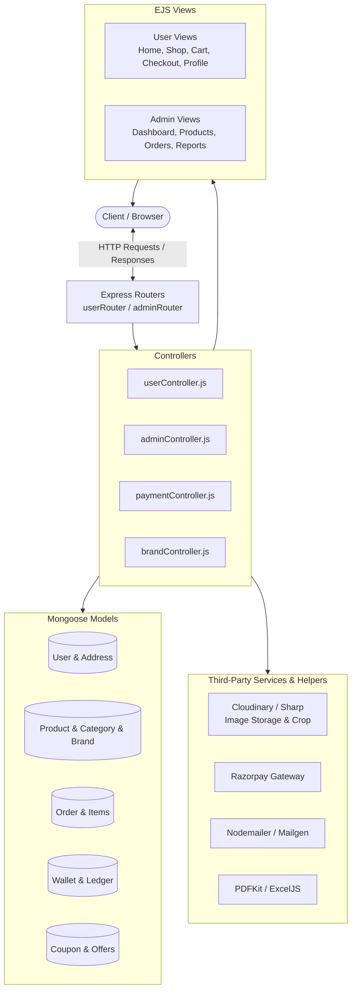

# 🛒 WizCart - Full-Featured E-Commerce Web Application

[](https://nodejs.org/)
[](https://expressjs.com/)
[](https://www.mongodb.com/)
[](https://ejs.co/)
[](https://razorpay.com/)
[](https://www.docker.com/)
[](https://opensource.org/licenses/ISC)

> **WizCart** is a modern, full-stack eCommerce platform built with **Node.js**, **Express.js**, **EJS**, and **MongoDB**. It provides a complete online shopping experience for customers and an administrative dashboard for store managers.

---

## 📌 Table of Contents

- [🌟 Project Overview](#-project-overview)
- [✨ Key Features](#-key-features)
  - [👤 Customer (User) Features](#-customer-user-features)
  - [🛡️ Admin Dashboard Features](#️-admin-dashboard-features)
- [🛠️ Tech Stack](#️-tech-stack)
- [🏗️ System Architecture](#️-system-architecture)
- [📁 Folder Structure](#-folder-structure)
- [⚙️ Prerequisites](#️-prerequisites)
- [🚀 Getting Started & Installation](#-getting-started--installation)
- [🔑 Environment Variables (.env)](#-environment-variables-env)
- [🐳 Running with Docker](#-running-with-docker)
- [🛣️ Main Routes & API Endpoints](#️-main-routes--api-endpoints)
- [💳 Payment & Refund Workflow](#-payment--refund-workflow)
- [📄 Database Models](#-database-models)
- [📜 License](#-license)

---

## 🌟 Project Overview

**WizCart** is designed using the **MVC (Model-View-Controller)** pattern. It delivers secure user authentication, responsive shopping pages, dynamic search and filtering, coupon and discount management, automated digital wallet refunds, invoice generation, and sales report exports in Excel and PDF formats.

---

## ✨ Key Features

### 👤 Customer (User) Features

* **🔐 Authentication & Security:**
  * User Registration with **Email OTP Verification** (via Nodemailer & Mailgen).
  * Secure Login with encrypted passwords (**bcrypt**).
  * **Google OAuth 2.0 Single Sign-On** using Passport.js.
  * Forgot Password / Reset Password workflow with OTP verification.
  * Session management with cache prevention (`nocache`) and secure cookies.

* **🛍️ Shopping & Discovery:**
  * Dynamic Homepage with banners, latest arrivals, and product categories.
  * **Shop Catalog** with multi-attribute filtering (Brand, Category, Price Range) and sorting (Price, Newest, Name).
  * Comprehensive Product Detail Page with image zoom, stock indicator, related items, and customer reviews/ratings.

* **❤️ Wishlist & Cart:**
  * Add or remove products to/from personal Wishlist.
  * Real-time Cart management with instant quantity increments/decrements and stock validation.

* **💳 Checkout & Payments:**
  * Multi-address book management (Add, Edit, Delete delivery addresses).
  * Multiple payment options:
    * **Cash on Delivery (COD)**
    * **Razorpay** (Credit/Debit Card, UPI, Net Banking)
    * **WizCart Digital Wallet**
  * Coupon discount codes with minimum purchase limits.
  * Support for pending/failed payment retry without re-ordering.

* **📦 Orders, Invoices & Wallet:**
  * Order Tracking with real-time status updates (*Pending, Shipped, Delivered, Cancelled, Returned*).
  * Single-item or complete order cancellation.
  * Order return request workflow with admin approval.
  * **Instant Refund to In-App Wallet** upon return acceptance or cancellation of prepaid orders.
  * **Download PDF Invoices** directly from the order details page.

---

### 🛡️ Admin Dashboard Features

* **📊 Dashboard & Analytics:**
  * High-level metrics: Total Revenue, Total Orders, Total Users, and Total Products.
  * Dynamic graphical sales analytics (Filter by Daily, Weekly, Monthly, and Custom Date Ranges).
  * Financial ledger book for tracking credit and debit transactions.

* **👥 Customer Management:**
  * View customer directory with contact info and registration status.
  * One-click User Block / Unblock functionality to manage access.

* **📦 Product & Inventory Management:**
  * Add new products with multiple images, category mapping, brand selection, and stock quantities.
  * Image cropping and optimization with **Sharp** and cloud storage via **Cloudinary**.
  * Edit product information and update/delete individual product images.
  * Soft-delete (Hide / Unhide) and permanent removal of products.

* **🏷️ Category & Brand Management:**
  * Category CRUD (Create, Read, Update, Delete) with unlist/list capability.
  * Brand management with brand logos and activation controls.

* **🎟️ Coupons & Offer Management:**
  * Create custom coupons (Fixed amount or Percentage discount, expiration dates, minimum cart value).
  * **Product Offers:** Apply direct promotional discounts on specific products.
  * **Category Offers:** Apply discounts across an entire category automatically.

* **🚚 Order & Return Management:**
  * View all customer orders with itemized breakdowns and shipping details.
  * Update order lifecycle status (*Pending -> Shipped -> Delivered*).
  * Process return requests: **Approve Return** (automatically triggers wallet refund) or **Reject Return**.

* **📑 Report Exports:**
  * Export sales reports to **Excel (`.xlsx`)** using ExcelJS.
  * Export sales reports to **PDF (`.pdf`)** using PDFKit.

---

## 🛠️ Tech Stack

### **Backend**
* **Runtime:** [Node.js](https://nodejs.org/) (v18+)
* **Framework:** [Express.js](https://expressjs.com/)
* **Database:** [MongoDB](https://www.mongodb.com/) (with [Mongoose ODM](https://mongoosejs.com/))
* **Authentication:** [Passport.js](http://www.passportjs.org/), `passport-google-oauth2`, `bcrypt`
* **Session Management:** `express-session`, `cookie-parser`, `connect-flash`

### **Frontend & Templating**
* **View Engine:** [EJS (Embedded JavaScript)](https://ejs.co/)
* **Styling & UI:** HTML5, CSS3, JavaScript (Vanilla / ES6), Bootstrap & FontAwesome icons
* **Client-side Alerts & Charts:** SweetAlert2, Chart.js

### **Third-Party Services & Utilities**
* **Payment Gateway:** [Razorpay API](https://razorpay.com/)
* **Image Processing & Storage:** [Sharp](https://sharp.pixelplumbing.com/), [Multer](https://github.com/expressjs/multer), [Cloudinary](https://cloudinary.com/)
* **Email Service:** [Nodemailer](https://nodemailer.com/), [Mailgen](https://github.com/eladnava/mailgen)
* **Document Generation:** [PDFKit](https://pdfkit.org/), [ExcelJS](https://github.com/exceljs/exceljs)
* **Development Utilities:** [Nodemon](https://nodemon.io/), [Morgan](https://github.com/expressjs/morgan)

---

## 🏗️ System Architecture

WizCart follows the standard **Model-View-Controller (MVC)** architectural pattern:



---

## 📁 Folder Structure

```text
ecom_Wizcart/
├── auth/                      # Authentication middlewares & strategy configs
│   ├── adminAuth.js           # Admin route guards (isLogin / isLogout)
│   ├── userAuth.js            # User route guards
│   └── google.js              # Google OAuth 2.0 strategy config
├── config/                    # Image upload & resizing configurations
│   ├── imageCroping.js        # Image crop helpers
│   └── imageResizing.js       # Multer and Sharp image pipelines
├── constants/                 # Application status codes and standard messages
│   ├── httpStatus.js
│   └── messages.js
├── controller/                # Application logic (Controllers)
│   ├── adminController.js     # Admin dashboard, products, categories, orders
│   ├── userController.js      # User auth, shop, cart, wishlist, address
│   ├── paymentController.js   # Razorpay verification & checkout flow
│   ├── brandController.js     # Brand operations
│   ├── productAdding.js       # Product addition helpers
│   └── errorController.js     # 404 & Global error handlers
├── lib/                       # Utility libraries & helper functions
│   ├── cartHelper.js          # Cart calculations
│   ├── cloudinary.js          # Cloudinary configuration & uploads
│   ├── env.js                 # Environment variable validation & exports
│   └── userSanitizer.js       # Data sanitization helpers
├── model/                     # Mongoose database schemas (Models)
│   ├── brandModel.js
│   ├── cartModel.js
│   ├── categoryModel.js
│   ├── categoryOfferModel.js
│   ├── couponModel.js
│   ├── orders.model.js
│   ├── productModel.js
│   ├── reviewModel.js
│   ├── userModel.js
│   ├── walletModel.js
│   └── wishlistModel.js
├── public/                    # Static assets (CSS, Client JS, Images, Icons)
├── router/                    # Express routing endpoints
│   ├── adminRouter.js         # All admin management routes
│   └── userRouter.js          # All client-side user routes
├── views/                     # EJS UI templates
│   ├── admin/                 # Admin dashboard and control panels
│   ├── user/                  # Customer storefront pages
│   ├── layout/                # Common layouts & partials
│   └── notFound.ejs           # 404 error page
├── .env                       # Environment variables (private)
├── dockerfile                 # Docker configuration
├── index.js                   # Application entry point
├── package.json               # Dependencies and scripts
└── README.md                  # Project documentation
```

---

## ⚙️ Prerequisites

Before you run the project locally, make sure you have installed:

1. [Node.js](https://nodejs.org/) (Version `18.x` or higher recommended)
2. [MongoDB](https://www.mongodb.com/) (Local instance or [MongoDB Atlas](https://www.mongodb.com/atlas) connection string)
3. [Git](https://git-scm.com/)
4. [Razorpay Account](https://razorpay.com/) (Test mode API Key & Secret)
5. [Cloudinary Account](https://cloudinary.com/) (For cloud image storage)
6. [Google Cloud Console Project](https://console.cloud.google.com/) (For Google OAuth login credentials)

---

## 🚀 Getting Started & Installation

Follow these step-by-step instructions to set up WizCart on your local machine:

### 1. Clone the repository
```bash
git clone https://github.com/AbhiramTB/ecom_Wizcart.git
cd ecom_Wizcart
```

### 2. Install dependencies
```bash
npm install
```

### 3. Set up Environment Variables
Create a `.env` file in the root directory:
```bash
cp .env.example .env
```
*(Fill in your credentials as shown in the next section).*

### 4. Start the Application
For development with auto-reload:
```bash
npm start
```
Or with node directly:
```bash
node index.js
```

### 5. Access the Web Application
Open your web browser and visit:
* **Customer Storefront:** `http://localhost:3100`
* **Admin Portal:** `http://localhost:3100/admin`

---

## 🔑 Environment Variables (.env)

Create a `.env` file in the root folder with the following variables:

```env
# Server Configuration
PORT=3100
CORS_ORIGIN=http://localhost:3100

# Database
MONGODB_CONNECT=mongodb://127.0.0.1:27017/wizcart

# Session & Cookie Security
COOKIE_SECRET=your_cookie_secret_key_here
SESSION_SECRET=your_session_secret_key_here

# Razorpay Payment Gateway
RAZORPAY_ID_KEY=your_razorpay_key_id
RAZORPAY_SECRET_KEY=your_razorpay_secret_key

# Google OAuth 2.0 Authentication
GOOGLE_CLIENT_ID=your_google_client_id
GOOGLE_CLIENT_SECRET=your_google_client_secret
GOOGLE_CALLBACK_URL=http://localhost:3100/auth/google/callback

# Email Service (Nodemailer)
EMAIL_SERVICE_EMAIL=your_email@gmail.com
EMAIL_SERVICE_PASSWORD=your_email_app_password

# Cloudinary Storage
CLOUDINARY_CLOUD_NAME=your_cloudinary_cloud_name
CLOUDINARY_API_KEY=your_cloudinary_api_key
CLOUDINARY_API_SECRET=your_cloudinary_api_secret
```

---

## 🐳 Running with Docker

WizCart includes a `dockerfile` for easy containerization.

### 1. Build the Docker Image
```bash
docker build -t wizcart-app .
```

### 2. Run the Docker Container
```bash
docker run -p 3100:3100 --env-file .env wizcart-app
```

Now open `http://localhost:3100` in your browser.

---

## 🛣️ Main Routes & API Endpoints

### 👤 User Endpoints (`/`)

| Method | Endpoint | Description | Access |
| :--- | :--- | :--- | :--- |
| `GET` | `/` | Home page | Public |
| `GET` | `/login` / `/signup` | User login / registration page | Guest |
| `POST` | `/loginData` | Authenticate user | Guest |
| `POST` | `/signupData` | Send registration OTP to email | Guest |
| `POST` | `/otpData` | Verify signup OTP & create account | Guest |
| `GET` | `/shopmore` | Product catalog with filters & search | Public |
| `GET` | `/singleProduct/:id`| Product detail page | Public |
| `GET` | `/cart` | View shopping cart | User (Logged in) |
| `GET` | `/addTocart` | Add item to cart | User (Logged in) |
| `PUT` | `/quantityUpdate` | Update cart item quantity | User (Logged in) |
| `GET` | `/wishlist` | View user's wishlist | User (Logged in) |
| `POST` | `/addtowishlist` | Add item to wishlist | User (Logged in) |
| `GET` | `/checkOut` | Checkout page | User (Logged in) |
| `POST` | `/confirmOrder` | Place new order / initialize payment | User (Logged in) |
| `POST` | `/applyCoupon` | Apply discount coupon code | User (Logged in) |
| `GET` | `/getOrderHistory` | View user order history | User (Logged in) |
| `POST` | `/ordercancellation`| Cancel ordered item | User (Logged in) |
| `POST` | `/orderreturn` | Request return for delivered item | User (Logged in) |
| `GET` | `/wallet` | View user wallet balance and ledger | User (Logged in) |
| `GET` | `/invoiceDownload/:objectId/:productId` | Download invoice PDF | User (Logged in) |

---

### 🛡️ Admin Endpoints (`/admin`)

| Method | Endpoint | Description | Access |
| :--- | :--- | :--- | :--- |
| `GET` | `/admin` | Admin login page | Guest |
| `GET` | `/dashboard` | Analytics dashboard with sales charts | Admin |
| `GET` | `/userList` | View all registered users | Admin |
| `POST` | `/blockUser` | Block / unblock a customer | Admin |
| `GET` | `/Products` | View all products | Admin |
| `GET` | `/addProduct` | Product creation page | Admin |
| `POST` | `/editProduct` | Edit product details and images | Admin |
| `POST` | `/HideProduct` | Soft delete / hide product from shop | Admin |
| `GET` | `/category` | Category management | Admin |
| `POST` | `/addCategory` | Create new category | Admin |
| `GET` | `/brands` | Brand management | Admin |
| `GET` | `/orderMangement`| View customer orders & status updates | Admin |
| `PUT` | `/acceptReturn` | Accept return request & refund to wallet | Admin |
| `GET` | `/couponMangement`| Manage discount coupons | Admin |
| `GET` | `/salesReport` | Sales reports with date filters | Admin |
| `GET` | `/download/excel`| Download sales report in Excel (`.xlsx`) | Admin |
| `GET` | `/download/pdf` | Download sales report in PDF (`.pdf`) | Admin |

---

## 💳 Payment & Refund Workflow

1. **Checkout:** The customer selects a delivery address and chooses a payment method (COD, Razorpay, or Wallet).
2. **Online Payment (Razorpay):**
   * Backend creates a Razorpay Order ID.
   * Frontend invokes Razorpay Checkout modal.
   * Payment signature is verified on `/api/payment/capture`.
3. **Pending Payment Recovery:** If network fails or user exits midway, order status is marked as `paymentPending`. The user can resume payment anytime from the Order History page.
4. **Cancellations & Returns:**
   * If a prepaid or wallet order is cancelled, the amount is **instantly refunded** to the user's WizCart Wallet.
   * If a return is requested and approved by the admin, the item status changes to `Returned` and funds are credited to the user's wallet with an entry in the transaction history.

---

## 📄 Database Models

WizCart utilizes **11 Mongoose Schemas** to maintain clean relational consistency:

* **`userModel.js`**: User credentials, contact info, profile picture, block status, and address subdocuments.
* **`productModel.js`**: Product name, description, category, brand, pricing, discount, stock, and image URLs.
* **`categoryModel.js` & `brandModel.js`**: Category names, descriptions, brand logos, and visibility flags.
* **`orders.model.js`**: Order numbers, item lists, shipping address snapshot, payment method, order statuses, and tracking.
* **`cartModel.js` & `wishlistModel.js`**: User-specific cart items and saved wishlist items.
* **`walletModel.js`**: User digital wallet balance, history of credits/debits, and transaction reasons.
* **`couponModel.js`**: Discount codes, minimum values, expiry dates, and usage tracking.
* **`categoryOfferModel.js`**: Category-level promotions and active date ranges.
* **`reviewModel.js`**: Customer product reviews and 1-5 star ratings.


---

<p align="center">
  Developed with ❤️👨🏻‍💻 by <a href="https://github.com/AbhiramTB">Abhiram</a>
</p>
